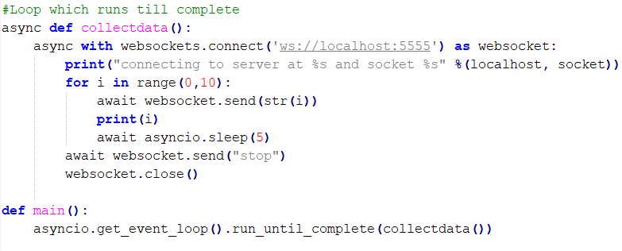

Note this example uses the async framework from python3. Take a look at [https://www.aeracode.org/2018/02/19/python-async-simplified/](https://www.aeracode.org/2018/02/19/python-async-simplified/) for a brief overview of async part.

Thus you need to use this code with python3. However, make sure you have the right packages first.

```
$ sudo apt-get install python3-pip
$ sudo pip3 install websockets
```


**Websockets**

Is a communication protocol providing full duplex communication over a
single TCP connection. The big advantage of using websockets is, polling
of the sockets for events is not required. Any incoming events can be
received even without polling the sockets, which was not the case in
other socket types. Websockets are typically used in real time
applications where data can arrive randomly at sockets.

In the example discussed below asynchronous communication happens
between the clients and the server.

Interesting read:
<https://medium.com/platform-engineer/web-api-design-35df8167460>

**Server.py**

Similar to the other socket programming discussed before the server
binds to a socket (host, port) and the client connects to the server.
Here the communication between the two happens in an asynchronous
fashion.


As seen in the example above, we start the server using the
start\_server = websockets.serve() command, which starts the server at
the provided host and port number. Here we also define the function our
server has to perform.

In this case the sensordata() function receives the data from the client
and you can see that it is defined as asynchronous. Await against the
recv function shows that the socket waits till it receives data from the
client. If the server receives a stop message from the client, then it
closes the websocket.

As before closing the websocket is very important to release the port,
if else it cannot be reused.

Asyncio.get\_event\_loop() is used to run the server or the defined the
function forever. Here the server runs forever and receives data until
the client has something to send.

**Client.py**

The client connects to the address of the server. After connecting
itself, the client sends a sequence of data to the server.



Similar to the server, the client runs the collectdata() function
forever till it has something to send. If it does not have anything to
send it terminates.

**Realtime example:**

Look at the link here <https://pro.coinbase.com/> , if you inspect it
you see that all the realtime trading works using websockets. The
trading can be highly dynamic, there can be people buying and selling
their coins at the same time. In this scenario having websockets helps.

The video here explains the difference between HTTP and websockets. It
is really interesting, watch it.
https://www.youtube.com/watch?v=i5OVcTdt\_OU
