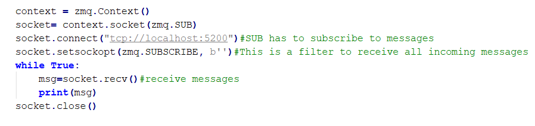
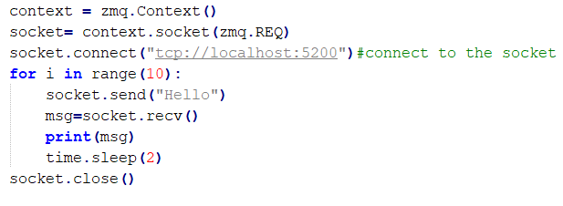

**Installation**

``
sudo apt-get install python-zmq
``

**ZeroMQ**
*****

Is a lightweight and asynchronous messaging library designed for
distributed applications. Is a message queue which is capable of working
without a dedicated broker. ZMQ supports some high level messaging
patterns which helps in making distributed messaging easier. For a
complete ZMQ explanation follow the link
(http://zguide.zeromq.org/page:all).

**Messaging patterns**

-   Publish/ Subscribe

-   Reply/ Request

-   Pipeline

-   Exclusive Pair

Using these high level patterns we can build some basic distributed
applications. Some examples are shown below.
*****

**Publish/ Subscribe**

Is a messaging pattern where the message senders are called the
publisher and the receivers are called as the subscriber.

**Publisher**

This is a simple example, where the publisher binds itself to a host
address and a port. After the publisher binds itself to a socket, it can
start sending messages.

**Zmq.Context()** ZMQ sockets are created using an initialized context.

**context.socket(zmq.PUB)** here we define the type of socket we want to
work with. Here we choose PUB

**socket.bind(‘address’)** after initializing a context and defining the
type of socket being used, we need to bind the socket to an address.
Once this bind is done, it can start publishing the messages.

**socket.send(‘message’)** is used to publish the messages.

**socket.close()** it is important to close the sockets after it has
been used. If it is not closed properly, you will get an address already
in use error.

**Subscriber**

In this example the subscriber connects to the address of the publisher
and starts receiving the messages published. Subscriber can have filters
called ‘topics’, which allows it to receive the messages of its choice.

**socket.setsockopt (zmq.SUBSCRIBE, b
’’)** can be thought of as the filter which passes the messages being
received at the socket. In this case the filter passes all the messages
being received in the socket.

**socket.recv()** is used to receive the messages. This receives the
filtered messages.
*****

**Reply/ Request**

One other important pattern which will be of importance is the REP/ REQ.
In this case one actor will request the data and the other will reply.
REQ-REP socket pair works in a lockstep.

**Reply**

Here the server replies to the clients request by sending a Hello
message.

**Request**

Here the client request for a message from the server. So, the client
sends a request message to the server and it replies for the requested
message.

REQ/ REP works similar to the PUB/ SUB pattern, but here the socket pair
works in a lockstep. For every request there has to be a reply from the
other actor involved.
*****

**Pollers**

Is a tool to monitor the sockets for any incoming messages. It is very
useful in scenarios where you will have to periodically monitor the
sockets for messages.

**Server.py**

In this simple example we have a server which receives messages
asynchronously from multiple clients. So we poll the socket to see the
incoming messages. The socket to poll has to be registered and it will
be monitored for any incoming event.

**poller=zmq.Poller()** instantiates a zmq poller.

**poller.register()** registers the required socket to be polled. In the
above example the socket is not explicitly named, hence it is still
being called as socket. Here the socket is registered to be polled.

**events=dict(poller.poll())** here the registered socket will be polled
for any incoming message. In the above example the socket will be always
listening for any incoming event, but this can be altered. You can have
time based pollers which can periodically listen for the socket.

**References**

-   <http://zguide.zeromq.org/page:all>

-   <https://learning-0mq-with-pyzmq.readthedocs.io/en/latest/pyzmq/multisocket/zmqpoller.html>

